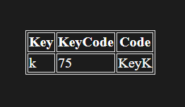
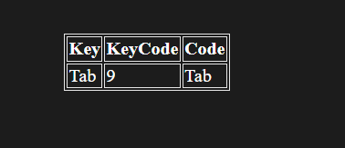
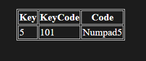

# Key Press Check
In this project, adding a 'keydown' event listener to the windows to check which key was pressed by user.

---

It then displays the key and its code using e.key, e.code and e.keyCode is deprecated now because we already have the e.code.

---

```javascript
windows.addEventListener('keydown', (e) => {
    insert.innerHTML = `
    <table>
        <tr>
            <th>Key</th>
            <th>KeyCode</th>
            <th>Code</th>
        </tr>
        <tr>
            <td>${e.key === ' ' ? 'Space': e.key}</td>
            <td>${e.keyCode}</td>
            <td>${e.code}</td>
        </tr>
    </table>`;
})
```

## Some screenshots



