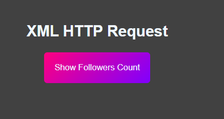

### Notes for whenever I come back for revision


Assignment: On loading the info of github user, a button should be shown.
On clicking that button it should the avatar and followers count.





``` javascript


```